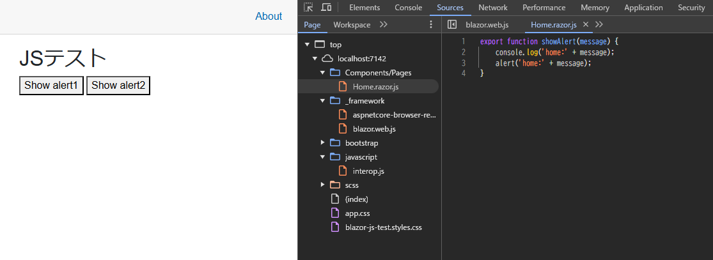

# Blazor の JavaScript相互運用

[ASP.NET Core Blazor JavaScript の相互運用性 (JS 相互運用) | Microsoft Learn](https://learn.microsoft.com/ja-jp/aspnet/core/blazor/javascript-interoperability/?view=aspnetcore-9.0)

概要

1. Visual StudioでBlazor Web Appプロジェクトを作成する
2. `wwwroot/javascript/interop.js` や `Components/Pages/XXX.razor.js` にファイルを置く
3. ~~`App.razor` にスクリプト読み込み `<script>` を追加する~~ 要らない？
4. `JS.InvokeAsync<IJSObjectReference>("import", "./javascript/interop.js");` でモジュールを読み込む
5. モジュールに対して `InvokeVoidAsync()` で JavaScript 関数を呼び出す

`wwwroot/javascript/interop.js`

```javascript
export function showAlert(message) {
    console.log(message)
    alert(message);
}
```

`App.razor`

```html
<!DOCTYPE html>
<html lang="en">

<head>
    <meta charset="utf-8" />
    <meta name="viewport" content="width=device-width, initial-scale=1.0" />
    <base href="/" />
    <link rel="stylesheet" href="bootstrap/bootstrap.min.css" />
    <link rel="stylesheet" href="app.css" />
    <link rel="stylesheet" href="blazor-js-test.styles.css" />
    <link rel="icon" type="image/png" href="favicon.png" />
    <HeadOutlet />
</head>

<body>
    <Routes />
    <script src="_framework/blazor.web.js"></script>
    <script src="interop.js" type="module"></script>
</body>

</html>
```

`Components/Pages/XXX.razor`

```cs
@page "/"
@rendermode InteractiveServer
@inject IJSRuntime JS

<PageTitle>JSテスト</PageTitle>

<h1>JSテスト</h1>

<p>
    <button @onclick="ShowAlertAsync">Show alert1</button>
    <button @onclick="ShowAlert2Async">Show alert2</button>
</p>


@code {
    private IJSObjectReference? module;
    private IJSObjectReference? module2;

    private async Task ShowAlertAsync(MouseEventArgs e)
    {
        module = module ?? await JS.InvokeAsync<IJSObjectReference>("import", "./javascript/interop.js");
        await module.InvokeVoidAsync("showAlert", "Hello from Blazor!");
    }

    private async Task ShowAlert2Async(MouseEventArgs e)
    {
        module2 = module2 ?? await JS.InvokeAsync<IJSObjectReference>("import", "./Components/Pages/Home.razor.js");
        await module2.InvokeVoidAsync("showAlert", "Hello from Blazor!");
    }
}
```



検索したりCopilotに聞いたりすると、 `App.razor` や `index.html` や `_Host.cshtml` に `<script>` 要素の追加をしていたが、今回試した限りではこれなしでも JavaScript 関数を呼び出せた。.NETのバージョン違い？わからない。
